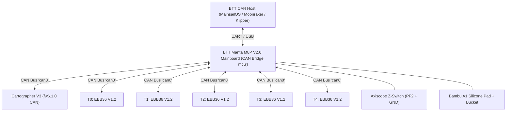

# Voron 2.4 StealthChanger (5-Tool Production)

[](https://www.klipper3d.org/)
[](https://stealthchanger.com/)
[](https://cartographer3d.com/)
[](https://docs.mainsail.xyz/)
[](https://github.com/SoftFever/OrcaSlicer)

Full production-grade configuration repository for a **Voron 2.4 350mm** CoreXY 3D printer running a **5-Head StealthChanger** toolchanger system powered by **Klipper**, **Moonraker**, **Cartographer V3**, and **BTT Manta M8P V2.0 + CM4**.

---

## 📑 Table of Contents

1. [Architecture & System Overview](#-architecture--system-overview)
2. [Hardware Stack & CAN Bus Topology](#-hardware-stack--can-bus-topology)
3. [Kinematics & Motion Limits](#-kinematics--motion-limits)
4. [StealthChanger Toolheads & Dock Layout](#-stealthchanger-toolheads--dock-layout)
5. [Probe, Leveling & Compensation Ecosystem](#-probe-leveling--compensation-ecosystem)
6. [Z-Offset Calibration & Hardware Switch](#-z-offset-calibration--hardware-switch)
7. [Bambu A1 Nozzle Cleaning System](#-bambu-a1-nozzle-cleaning-system)
8. [Print Macros & Thermal Management](#-print-macros--thermal-management)
9. [Repository Layout & Code Organization](#-repository-layout--code-organization)
10. [Deployment & Automatic Synchronization](#-deployment--automatic-synchronization)
11. [OrcaSlicer Multi-Color Integration](#-orcaslicer-multi-color-integration)
12. [Safety & Development Guidelines](#-safety--development-guidelines)

---

## 🌐 Architecture & System Overview

This machine is engineered for fast, reliable multi-material and multi-color 3D printing without waste towers or purge flushes:



- **Kinematic Base:** Voron 2.4 (350×350×345mm) CoreXY with Flying Gantry.
- **Tool Changing:** StealthChanger kinematic magnetic shuttle with 5 individual toolheads (T0–T4) parked at the rear gantry beam ($Z=343\text{mm}$).
- **Primary Bed Sensing:** Eddy-current Cartographer V3 sensor combining Touch Mode for accurate Z0 and ultra-fast Scan Mode for dense 55×55 adaptive bed meshes.
- **Hardware Z Calibration:** Stationary microswitch probe mapped to pin `^PF2` ($X=68.0, Y=-10.0, Z=7.0$) for hardware tool length drift tracking.
- **Nozzle Maintenance:** Automated high-speed flick and 360° circular scrubbing on a Bambu A1 silicone pad with an integrated purge bucket.

---

## 🛠️ Hardware Stack & CAN Bus Topology

### 1. Main MCU & Sensors (`mcu` — BTT Manta M8P V2.0)
- **CAN Bus UUID:** `19b203d75137` (`can0` @ 1,000,000 baud)
- **X Endstop:** `PF0` (Physical microswitch at $X=350$)
- **Y Endstop:** `PF1` (Physical microswitch at $Y=350$, min travel: $Y=-10$)
- **Z Steppers:** 4× NEMA17 (80:16 gear ratio) on drivers `PG9`, `PB4`, `PG13`, `PB8`
- **Chamber Sensor:** Generic 3950 100K NTC on port `THB` (`PB1`)
- **Bed Heater:** AC Silicone Pad with SSR on `PA1`, Thermistor on `PB0` (NTC 100K MGB18)
- **Bed Fans:** Dual 5015 / 4020 fans on `PF8` (`Fan3`) for chamber circulation
- **Z-Offset Calibrator:** Microswitch on `^PF2` + GND at $X=68.0, Y=-10.0, Z=7.0$

### 2. Toolhead MCUs & Extruders (5× BTT EBB36 V1.2)

| Tool | CAN Bus UUID | Extruder Motor | Hotend / Thermistor | Part Fan / Hotend Fan | Tool Status Pin | Status NeoPixel |
| :---: | :---: | :---: | :---: | :---: | :---: | :---: |
| **T0** | `441e1484ac41` | WW BMG (TMC2209 @ 0.6A) | TZ V6 2.0 / 3950 NTC | `PA1` / `PA0` (50°C) | `^!EBB0:PB6` | `EBB0:PD3` (3× GRB) |
| **T1** | `6475b5b9e028` | WW BMG (TMC2209 @ 0.6A) | TZ V6 2.0 / 3950 NTC | `PA1` / `PA0` (50°C) | `^!EBB1:PB6` | `EBB1:PD3` (3× GRB) |
| **T2** | `4ad9d622a836` | WW BMG (TMC2209 @ 0.6A) | TZ V6 2.0 / 3950 NTC | `PA1` / `PA0` (50°C) | `^!EBB2:PB6` | `EBB2:PD3` (3× GRB) |
| **T3** | `c2465b7c36f8` | WW BMG (TMC2209 @ 0.6A) | TZ V6 2.0 / 3950 NTC | `PA1` / `PA0` (50°C) | `^!EBB3:PB6` | `EBB3:PD3` (3× GRB) |
| **T4** | `28650279df58` | WW BMG (TMC2209 @ 0.6A) | TZ V6 2.0 / 3950 NTC | `PA1` / `PA0` (50°C) | `^!EBB4:PB6` | `EBB4:PD3` (3× GRB) |

### 3. Surface & Z-Probe (`cartographer` — Cartographer V3 Flat)
- **CAN Bus UUID:** `da13d909ce34` (`can0`)
- **Firmware Version:** `6.1.0` (Native Klipper Cartographer plugin support)
- **Mount Offsets:** $X = 0\text{mm}$, $Y = 35.0\text{mm}$, $Z = 0\text{mm}$ (relative to carriage)

---

## ⚡ Kinematics & Motion Limits

Configured in [printer.cfg](file:///c:/Users/batca/OneDrive/Desktop/All-Config-Voron-main/Voron%205%20Tool/config/printer.cfg) and [hardware.cfg](file:///c:/Users/batca/OneDrive/Desktop/All-Config-Voron-main/Voron%205%20Tool/config/Printer-Setup/hardware.cfg):

| Parameter | Configured Value | Operational Purpose |
| :--- | :--- | :--- |
| **Kinematics** | `corexy` | Voron 2.4 dual-belt gantry |
| **Max Velocity (X/Y)** | $300\text{ mm/s}$ | High-speed travel |
| **Max Acceleration** | $4,000\text{ mm/s}^2$ | Print acceleration |
| **Max Z Velocity** | $60\text{ mm/s}$ | Elevated for fast tool dropoff/pickup Z clears |
| **Max Z Acceleration** | $700\text{ mm/s}^2$ | Fast Z-hop motion during tool switching |
| **Square Corner Velocity** | $5.0\text{ mm/s}$ | Smooth tool change transitions |
| **X Travel Range** | $0 \rightarrow 350\text{ mm}$ | Endstop at $X=350$ (`PF0`) |
| **Y Travel Range** | $-10 \rightarrow 350\text{ mm}$ | Negative Y allows nozzle cleaner & switch access |
| **Z Travel Range** | $-5 \rightarrow 345\text{ mm}$ | Z=343 reaches tool docks at rear top frame |

---

## 🔧 StealthChanger Toolheads & Dock Layout

The StealthChanger system uses rear-mounted docks. Each tool has precise park coordinates calibrated to physical alignment:

```
Rear Frame (Y ~ 0 to 3mm, Z = 343mm)
[ Dock T0 ]     [ Dock T1 ]     [ Dock T2 ]     [ Dock T3 ]     [ Dock T4 ]
X: 30.20        X: 104.00       X: 176.00       X: 249.50       X: 321.50
Y: 1.30         Y: 1.10         Y: 1.60         Y: 2.50         Y: 2.60
---------------------------------------------------------------------------
                       Print Bed (350 × 350 mm)
```

### Motion Paths:
- **Dropoff Path:** `[{'y':9.5, 'z':3}, {'y':9.5, 'z':1.5}, {'y':5.5, 'z':0}, {'z':0, 'y':0, 'f':0.5}, {'z':-12, 'y':0}, {'z':-12, 'y':16}]`
- **Pickup Path:** `[{'z':-12, 'y':16}, {'z':-12, 'y':0}, {'z':0, 'y':0, 'f':0.5, 'verify':1}, {'y':5.5, 'z':0}, {'y':9.5, 'z':1.5}, {'y':9.5, 'z':3}]`
- **Crash Protection:** Handled via [crash_detection_override.cfg](file:///c:/Users/batca/OneDrive/Desktop/All-Config-Voron-main/Voron%205%20Tool/config/Printer-Setup/crash_detection_override.cfg) and [tool_crash_cartographer.cfg](file:///c:/Users/batca/OneDrive/Desktop/All-Config-Voron-main/Voron%205%20Tool/config/Printer-Setup/tool_crash_cartographer.cfg).

---

## 📐 Probe, Leveling & Compensation Ecosystem

The leveling and tramming pipeline consists of four complementary layers:

### 1. Quad Gantry Leveling (QGL)
- **Macro:** `QUAD_GANTRY_LEVEL`
- **Probe Points:** $(50, 25)$, $(50, 275)$, $(300, 275)$, $(300, 25)$
- **Retry Tolerance:** `0.0075mm` (optimized for mechanical repeatability without false aborts)
- **Speed:** $150\text{ mm/s}$ travel, $10\text{ mm/s}$ probing

### 2. Axis Twist Compensation
- Corrects mechanical extrusion/rail twist along the X gantry beam across 5 points ($X: 20 \rightarrow 320\text{mm}$).
- Active compensation vector: `[-0.131572, -0.016120, 0.021188, 0.062078, 0.064427]`

### 3. Cartographer Touch & Scan Modes
- **Touch Mode:** Probes the bed directly at reference point $(174, 168)$ with `threshold: 1819` and `speed: 2` to lock in absolute Z0.
- **Scan Mode:** High-speed eddy-current scanning creating an ultra-dense $55 \times 55$ adaptive bed mesh ($3,025$ points) without wearing the nozzle tip.
- **Zero Reference Point:** $(174, 168)$ — perfectly aligned with the physical nozzle homing location.

---

## 🎯 Z-Offset Calibration & Hardware Switch

To ensure absolute first-layer quality while retaining automated hardware tracking, this setup employs a **Dual-Strategy Architecture**:

```
                                  [ Z-Offset Architecture ]
                                              │
                    ┌─────────────────────────┴─────────────────────────┐
                    ▼                                                   ▼
       【 Production Parameters 】                            【 Hardware Reference 】
     Empirical First-Layer Tuning                       Axiscope Microswitch (PF2)
     Saved in printer.cfg SAVE_CONFIG                    Baseline Trigger Heights
     Guarantees 100% perfect squish                      Tracks mechanical drift over time
```

### 1. Active Production Offsets (`printer.cfg`)

| Tool | X Offset (mm) | Y Offset (mm) | Z Offset (mm) | Description / First-Layer State |
| :---: | :---: | :---: | :---: | :--- |
| **T0** | `0.000` | `0.000` | `0.000` | Reference Master Tool (Z0 datum) |
| **T1** | `-0.243` | `-0.252` | **`+0.228`** | Empirically tuned for optimal squish |
| **T2** | `+0.746` | `+0.086` | **`-0.295`** | Matches switch reading within 12 microns |
| **T3** | `+0.304` | `+0.449` | **`-0.268`** | Empirically tuned for smooth extrusion |
| **T4** | `+0.041` | `+0.352` | **`+0.086`** | Empirically tuned for tight adhesion |

> [!NOTE]
> `gcode_z_offset` in Klipper acts strictly as an initial coordinate transform ($Z' = Z + \text{offset}$). **It never accumulates across layers 2, 3, ... 1000.** Once layer 1 is level and well-squished, the entire print height is 100% controlled by the Z stepper rotation distance (`40mm`).

### 2. Hardware Switch Reference (`calibration.cfg`)
- **Switch Location:** $X = 68.0$, $Y = -10.0$, $Z = 7.0$
- **Switch Pin:** `^PF2` on Manta M8P V2 (internal pull-up enabled)
- **Baseline Readings:** $T_0 = 6.400\text{mm}$, $T_1 = 6.480\text{mm}$, $T_2 = 6.093\text{mm}$, $T_3 = 6.267\text{mm}$, $T_4 = 6.366\text{mm}$
- **Usage:** Run `AXISCOPE_CALIBRATE_Z` after hotend disassembly or nozzle swaps to compute delta shifts without reprinting full test swatches.

---

## 🧼 Bambu A1 Nozzle Cleaning System

Integrated nozzle cleaning routine in [nozzle-clean.cfg](file:///c:/Users/batca/OneDrive/Desktop/All-Config-Voron-main/Voron%205%20Tool/config/Printer-Setup/nozzle-clean.cfg):

```
                   Front Bed Extrusion (Y = -7 to -10)
  [ X=277 ........................ Silicone Pad ........................ X=312 ]   [ Purge Bucket: X=320 ]
  <-------------------------- 5-Point 360° Circular Arcs ------------------------->   <--- High-Speed Flick ---
```

### Geometric Parameters:
- **Bucket Center:** $X = 320.0$, $Y = -8.0$
- **Pad Active Area:** $X: 277.0 \rightarrow 312.0$, $Y: -7.0 \rightarrow -10.0$ (Center $Y = -8.0$)
- **Scrub Height:** $Z = 1.2\text{mm}$
- **Flick Snap-Back Speed:** $13,500\text{ mm/min}$ ($225\text{ mm/s}$)
- **Circular Arc Scrub:** Executes alternating CW ($G2$) and CCW ($G3$) arcs ($R = 1.5\text{mm}$) across 5 discrete points along the silicone brush.

### Usage Commands:
```gcode
CLEAN_NOZZLE                             ; Quick wipe at 150°C (called during PRINT_START)
CLEAN_NOZZLE WIPES=8 TEMP=160           ; Custom wipes and temperature
PURGE_AND_CLEAN PURGE=15 PURGE_TEMP=240   ; Extrude 15mm into bucket -> cool to 150°C -> scrub
```

---

## 🚀 Print Macros & Thermal Management

### `PRINT_START` Workflow:
1. **Chamber & Bed Heating:** Bed heats to target temp; chamber soaks until threshold is reached.
2. **Homing & Leveling:** G28 homing $\rightarrow$ `QUAD_GANTRY_LEVEL` $\rightarrow$ Nozzle heats to $150^\circ\text{C}$ $\rightarrow$ `CLEAN_NOZZLE`.
3. **Z0 Touch & Adaptive Mesh:** Cartographer Touch at $(174, 168)$ $\rightarrow$ `BED_MESH_CALIBRATE` (scans only the bounding box of printed objects).
4. **Tool Preparation:** Selects first print tool $\rightarrow$ Heats to full extrusion temperature $\rightarrow$ Runs tool-specific prime line.

### `PRINT_END` Workflow:
- Retracts filament by $5\text{mm}$ to prevent oozing inside the tool dock.
- Raises Z by safe distance, moves tool to safe dropoff position, sets hotends and bed to idle/off.
- Turns off part cooling fans and sets status LEDs to ready state.

---

## 📁 Repository Layout & Code Organization

```
Voron 5 Tool/
├── README.md                 ← Master documentation (this file)
│
├── config/                   ← Active Klipper configuration payload
│   ├── README.md             ← Config payload notes & pin mapping
│   ├── printer.cfg           ← Core entry point & SAVE_CONFIG block
│   ├── KlipperScreen.conf    ← KlipperScreen touch UI configuration
│   ├── moonraker.conf        ← Moonraker API server configuration
│   ├── crowsnest.conf        ← Camera streamer configuration (WebRTC)
│   ├── mainsail.cfg          ← Mainsail web interface macro bundle
│   │
│   ├── Printer-Setup/        ← Modular printer configuration files
│   │   ├── hardware.cfg      ← Steppers, MCUs, heaters, thermistors
│   │   ├── fans-leds.cfg     ← Chamber fans, bed fans, tool NeoPixels
│   │   ├── calibration.cfg   ← Thermal calibration & [axiscope] switch
│   │   ├── input-shaper.cfg  ← Accelerometer and resonance filters
│   │   ├── probe-mesh.cfg    ← Cartographer V3 parameters & bed mesh
│   │   ├── nozzle-clean.cfg  ← Silicone brush & purge bucket macros
│   │   ├── prime-lines.cfg   ← Individual prime lines for T0–T4
│   │   ├── print-macros.cfg  ← PRINT_START, PRINT_END, helper macros
│   │   ├── crash_detection_override.cfg ← Tool crash detection overrides
│   │   └── tool_crash_cartographer.cfg  ← Cartographer crash safety
│   │
│   ├── toolchanger/          ← StealthChanger KTC-Easy toolchanger config
│   │   ├── toolchanger-config.cfg ← Dropoff/pickup paths & park coords
│   │   ├── tools/            ← Toolhead definitions (T0.cfg to T4.cfg)
│   │   └── readonly-configs/ ← KTC-Easy managed scripts (DO NOT EDIT)
│   │
│   └── scripts/              ← Deployment & maintenance shell scripts
│       ├── install.sh        ← Clean install script (auto-excludes *.md)
│       ├── update.sh         ← Auto-backup & update script (excludes *.md)
│       └── cleanup-voron.sh  ← Maintenance & backup directory cleaner
│
├── Orca Config/              ← Custom OrcaSlicer machine & process profiles
│
└── extras/                   ← Documentation, backups, and diagnostic archives
    ├── backups/              ← Timestamped configuration backups (Git synced)
    ├── Nhat-ky-chinh-sua/    ← Daily engineering change logs (Vietnamese)
    ├── pictures/             ← Hardware photos and schematics
    ├── gcode/                ← Test print files
    ├── docs/                 ← Technical manuals and references
    ├── Orcasilcer setting/   ← Exported slicer profile backups
    ├── axiscope-cartographer/← Axiscope & Cartographer calibration logs
    └── logs/                 ← Klippy and Moonraker log files for offline debugging
```

---

## 💻 Deployment & Automatic Synchronization

> [!TIP]
> The deployment scripts (`install.sh` and `update.sh`) automatically use `rsync` with `--exclude "README.md" --exclude "*.md"` to ensure that markdown files stay on GitHub and never clutter your Klipper configuration directory on the printer.

### 1. First-Time Setup on Fresh Host (SSH)
```bash
# Clone repository into /tmp and run installer
cd /tmp && git clone git@github.com:IDcrazy123/All-Config-Voron.git
cd All-Config-Voron && bash "Voron 5 Tool/config/scripts/install.sh"

# Restart services
sudo systemctl restart moonraker klipper
```

### 2. Pulling Updates from GitHub
Whenever updates are pushed to GitHub, apply them to the machine with one command:
```bash
cd ~/printer_data/config && bash scripts/update.sh
sudo systemctl restart moonraker klipper
```
*This automatically creates a timestamped backup under `~/printer_data/config_backups/` before pulling and applying changes.*

---

## 🎨 OrcaSlicer Multi-Color Integration

Exported and tuned profiles are stored under [extras/Orcasilcer setting/](file:///c:/Users/batca/OneDrive/Desktop/All-Config-Voron-main/Voron%205%20Tool/extras/Orcasilcer%20setting/):

- **Machine G-Code Type:** `Klipper Toolchanger`
- **Tool Change G-Code:** `T[next_extruder]` (KTC-Easy automatically handles dropoff/pickup, standby temperatures, and input shaper swapping).
- **Prime Tower:** Disabled or set to minimal volume (purge bucket + silicone wipe handles nozzle cleaning without wasting plastic).
- **Retraction on Toolchange:** $1.0\text{mm} \sim 2.0\text{mm}$ at $40\text{mm/s}$.

---

## 🛡️ Safety & Development Guidelines

1. **Production System Rule:** This machine is an active manufacturing tool. All modifications must be verified for syntax and mechanical clearance before running.
2. **Mandatory Backup:** Always create a timestamped backup folder under `extras/backups/pre-[task]-[YYYYMMDD]-[HHmmss]/` before editing any `.cfg` file.
3. **Protected Directories:** Never edit files inside `config/toolchanger/readonly-configs/` (auto-managed by KTC-Easy).
4. **Session Logging:** Every change must be recorded in `extras/Nhat-ky-chinh-sua/YYYY-MM-DD-session-updates.md`.
5. **AI Assistant Protocol:** Review [`.agents/AGENTS.md`](file:///c:/Users/batca/OneDrive/Desktop/All-Config-Voron-main/.agents/AGENTS.md) for full coding conventions, safety rules, and prompt workflows.
