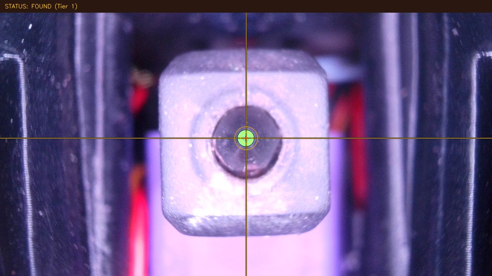

# TKC hardware trial — 2026-09-06

TKC completed **two full five-tool XY cycles; the third aborted at T2**. Its camera detection and affine calibration work on this printer after measured bootstrap, but this revision is not ready for unattended offset application. No tool offsets were applied, no Z-offset calibration or print test was performed, and no tolerance was relaxed to force a pass.

Source: [TKC at 780a492](https://github.com/IDcrazy123/Tool-Klipper-Calibration/tree/780a492bad45399698491a355ab62db6954da9d7). Deployment details and commands are in [README.md](README.md). Evidence timestamps use Asia/Ho_Chi_Minh (UTC+7).

## Hardware and scope

Voron 2.4 StealthChanger, T0–T4, KTC-Easy, MF-500 at native 1280×720, Cartographer V3 firmware 6.1.0 with host plugin 1.9.0. The operator confirmed normal G28 and Z=40 clearance before tool changes. Tests used cold nozzles, zero heater targets, the camera's built-in illumination, and tool LEDs off. Camera approach/travel/Z speeds were 10/30/10 mm/s; production motion limits and KTC dock paths were preserved.

The service runs separately on loopback port 8090. Klipper delegates HTTP work to background threads and yields through the reactor while waiting. The vision service pulls JPEG snapshots, detects the nozzle, and maps image coordinates to machine displacement. The Klipper client moves through the safe station approach, iterates centering with damping 0.55, measures each tool's raw machine position relative to T0, and optionally saves results. This trial forced `SAVE_CONFIG=0` and `CALIBRATE_Z=0`.

## Measurements

- Upstream tests on the printer host: **78 passed**, 5.640 seconds. These are software tests, not proof of hardware reliability.
- Initial stationary inspection: **7/7 frames**, UV `(680.15, 310.50)`, radius `22.50 px`, dispersion `0.20 px`.
- Independent +/-0.5 mm bootstrap: `du/dX = -44.0 px/mm`, `dv/dY = -42.95 px/mm`. Both image axes run opposite to the fallback assumption. Baseline return shifted 2.00 px in V; stationary detection precision alone does not establish mechanical repeatability.
- Native `CALIBRATE_CAMERA_SCALE DISTANCE=0.5`: four valid displacements, **0.022750 mm/pixel**, affine matrix solved. X shifts: 21.95/22.05 px; Y shifts: 21.00/23.00 px.
- Saved station: X170.923 Y18.905 Z40; approach X171.456 Y43.920. These are measured coordinates for this installation.

All values below are **TKC-reported XY offsets in mm**, not corrections to add blindly to existing offsets. The third run is incomplete and excluded from complete-cycle statistics. T0 is defined as zero within each cycle, so zero in the table is not a repeatability measurement.

| Tool | Cycle 1 X / Y | Cycle 2 X / Y | Complete-cycle X range | Complete-cycle Y range |
|---|---:|---:|---:|---:|
| T0 | 0 / 0 | 0 / 0 | — | — |
| T1 | -0.174 / -0.260 | -0.152 / -0.290 | 0.022 | 0.030 |
| T2 | +0.865 / +0.285 | +0.875 / +0.253 | 0.010 | 0.032 |
| T3 | +0.355 / +0.545 | +0.357 / +0.521 | 0.002 | 0.024 |
| T4 | +0.155 / +0.218 | +0.143 / +0.197 | 0.012 | 0.021 |

Cycle 3 measured T1 at X-0.152 Y-0.306, then aborted at T2 at 18:17:38 with `ERR_CV_202`. T2's fifth burst had 5.0 px dispersion, and centering failed the unchanged 0.015 mm threshold after five steps. The client lifted/departed to Z40; KTC subsequently cleared the active tool on the G-code error. No partial results were applied. `cached_offsets` still contained cycle 2, so it must not be treated as cycle 3 data.

Twenty stationary T2 frames after the failure all detected successfully, with U fixed at 641.0 and V between 360.85 and 360.95. This does **not** establish persistent detector ambiguity as the cause. Transient image lag, mechanical settling, and the iteration budget remain candidates. At damping 0.55, an ideal initial error of 0.863 mm leaves about `0.863 × 0.45^5 = 0.0159 mm` after five corrections, already close to or beyond the threshold.

After returning T0, centering gave X170.896 Y18.940 at Z40. A separate restart/persistence check then homed normally, loaded the saved station and matrix, and ended at **X170.8882 Y18.8799 Z40** with **7/7 frames, 0.35 px dispersion**. Rehoming changed the measurement context; this last position is not mixed into the repeatability table.

## Findings for TKC development

1. **Uncalibrated fallback can drive the wrong direction.** At initial UV `(680.95,310.95)`, the fallback returned correction `(-0.9009,+1.0791) mm`; the independently measured transform returned `(+0.5169,-0.6281) mm`. Only the measured transform was used for motion. Remove automatic motion based on assumed axis orientation/0.040 MPP; bootstrap from bounded observed displacements and require a valid Jacobian. See [affine_transform.py](https://github.com/IDcrazy123/Tool-Klipper-Calibration/blob/780a492bad45399698491a355ab62db6954da9d7/server/affine_transform.py#L194).

2. **Frame-quality gates and iteration budget need work.** `_sample_burst` accepts one valid frame from a requested burst, considers consensus only above 15 px, and does not use the selected cluster to recompute the median. At this scale, 15 px is about 0.341 mm; a 5 px spread is about 0.114 mm. The displayed 98% confidence is a constant for the curvature branch, not an estimated probability. Use minimum valid-frame counts, a calibrated physical spread threshold, cluster-only estimates, and logged final verification errors. Size the bounded iteration budget for initial error without relaxing accuracy requirements. See [burst/centering code](https://github.com/IDcrazy123/Tool-Klipper-Calibration/blob/780a492bad45399698491a355ab62db6954da9d7/klippy/extras/tool_calibrator.py#L296) and [confidence assignment](https://github.com/IDcrazy123/Tool-Klipper-Calibration/blob/780a492bad45399698491a355ab62db6954da9d7/server/nozzle_detector.py#L491).

3. **Expose an explicit running/failed run record.** During cycle 1 the status remained `UNINITIALIZED`; during later cycles it remained the previous `SUCCESS`. After failure, old offsets remained cached. Add run ID, RUNNING state, active tool, timestamps, and validity per result. KTC-Easy clears active tool on any `gcode:command_error`; recovery must inspect detected/physical tool state. The machine wrapper caught this before a new cycle. See [cycle orchestration](https://github.com/IDcrazy123/Tool-Klipper-Calibration/blob/780a492bad45399698491a355ab62db6954da9d7/klippy/extras/tool_calibrator.py#L707).

4. **Long HTTP requests can outlive the client.** Port 80 returned nginx 504 after **60.020 s**, while the original cycle continued through the remaining tools and completed. Cycle 2 completed over direct Moonraker port 7125 in **173.714 s**. Do not resubmit after timeout. A run ID plus asynchronous start/status/cancel interface would make this clearer.

5. **Dry-run and saved-offset semantics are easy to misunderstand.** `DRY_RUN=1` still changes tools and centers XY. The new `[tool_offsets]` object stores numbers but does not apply them to KTC tool definitions; saving a file is not the same as activating calibrated offsets. A reviewed KTC apply transaction and rollback are still needed. The previous daily-log claim that any repeated `[tool T*]` section necessarily crashes Klipper was too broad: this installed parser uses `strict=False`; repeated sections can override options. Do not duplicate ownership as an apply mechanism. See [tool_offsets.py](https://github.com/IDcrazy123/Tool-Klipper-Calibration/blob/780a492bad45399698491a355ab62db6954da9d7/klippy/extras/tool_offsets.py).

6. **Persistence works here, with limits.** Manual X/Y config overrides learned X/Y on reload; the final experiment config omits them. `_ensure_vision_sync` reads `has_matrix`, but `/health` publishes `matrix_solved`, causing unnecessary matrix reloads. The scale fit uses displacement relative to its baseline, so its affine intercept targets that baseline rather than necessarily exact image center. Starting close to image center limited this effect in the trial. These are source-review findings, not demonstrated collisions.

7. **Restart the process when updating Python.** The first soft restart used the previous installation's cached Python module and reported an obsolete `CALIBRATION_STATUS` collision. Restarting the Klipper service process loaded 780a492 successfully; no rename or source patch was needed. The daemon reports `0.8.8`, so retain the commit hash in diagnostics as well.

## Verification and retained limits

Across 918 captured stats samples after the fresh Klipper process started at 18:05:52, all seven CAN nodes stayed active with RX/TX errors and TX retries at zero. The `print_stall` counter reached 2 during the trial and reset to 0 with the final restart; this is not a stall-free performance result. No scheduling-deadline, communication-loss, short-to-supply, or shutdown message was found in that window. The stall causes were not isolated; repeat scheduling tests under representative load before claiming real-time safety.

All five tool files and `calibration-probe.cfg` match the original bytes. The printer SAVE_CONFIG block is unchanged. The only live `printer.cfg` change is the experiment include; the production Git config remains unchanged. No PID, current, motion limit, offset apply, Z measurement, heating, or print test was performed. TKC's Z backend is intentionally guarded until its Cartographer semantics and measurement path are reviewed separately.

Files: [measurements CSV](xy-measurements.csv), [structured summary](summary.json), [session console](evidence/console-session.txt), [pilot points](evidence/pilot.json), [failure state](evidence/xy-cycle-3-failed-state.json), [integrity checks](evidence/production-integrity.json), [runtime health](evidence/runtime-health.json), and [final state](evidence/final-state.json). Large raw logs stay locally under `extras/logs/tkc-20260906/` and are excluded from Git.

