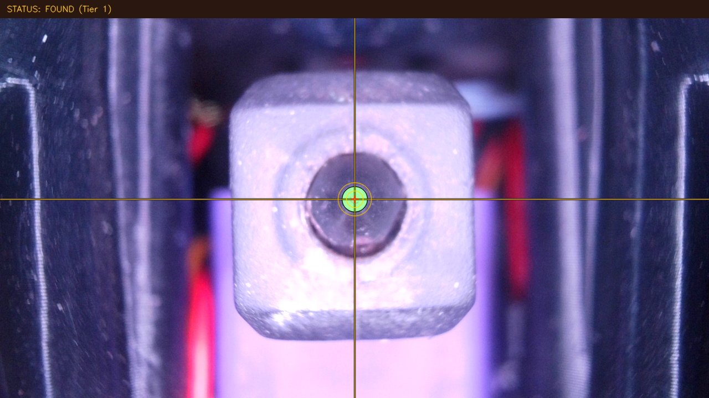

# TKC 0.8.18 / b6c3328: updated hardware trial

The updated revision bootstrapped its own camera transform and completed **3/3 five-tool XY cycles** after a one-line startup fix. Maximum observed repeat range was **0.026 mm X / 0.033 mm Y**. It still has defects that prevent approval for unattended XYZ calibration or automatic offset application.

Source: [b6c332862a87043238b068dd55b5f5ee433efdb6](https://github.com/IDcrazy123/Tool-Klipper-Calibration/tree/b6c332862a87043238b068dd55b5f5ee433efdb6). The installed source differs only by [startup-imports.patch](startup-imports.patch). [Deployment and recovery](README.md) document the exact environment and backups.

**Installation clarification, verified 2026-09-06:** TKC is installed on the real printer host and loaded by real Klipper. This was a manual installation for supervised hardware XY testing, not a run of the upstream installer or a complete installation of its macro/Update Manager workflow. The vision service uses a custom user unit, two workers, and a system-site-packages venv with Debian OpenCV4.6.0; the `opencv-python-headless` pip distribution is absent. Other recorded dependency versions meet the published ranges. These distinctions were not prominent enough in the original report. See the [installation audit and evidence-level table](INSTALLATION_AUDIT.md) before using this report to change upstream code or deployment instructions.

The three XY cycles and abort probe were physical tests. The Z-sign, session fault and false-success reproductions were offline dummy-printer tests, not faults deliberately executed on the machine. Runtime buffering observations are not a demonstrated TKC root cause. The 91 passing tests are software tests in the recorded environment, not validation of the official installer.

## Scope and operation

Real printer `192.168.1.43`: Voron 2.4, five StealthChanger tools, KTC-Easy, MF-500 camera at native 1280x720. The operator authorized ordinary G28 and Z40 before tool changes. The session used cold tools, all heater targets zero, camera illumination and nozzle LEDs off. Existing dock paths and production motion/current/heater settings were retained.

Only XY was measured. The guarded wrapper set `CALIBRATE_Z=0 SAVE_CONFIG=0 WIGGLE=0 SAMPLES=3`; tolerance stayed at 0.015 mm. New upstream default centering budget was 8 steps. The Z backend remained blocked, given the sign defect described below. No print, heat, offset apply or physical Z-calibration test was performed.

The vision daemon detects the nozzle in snapshot images and maps image-center error through the measured affine transform. Klipper applies damped corrections (0.55), then records each tool's **raw carriage position minus the T0 reference carriage position**. Reported offsets are measurement candidates, not deltas to add blindly to production offsets.

## Improvements verified

- **Native bootstrap now works.** The old MPP/matrix entries were removed from the backed-up experimental station data; measured safe waypoints were retained. `/health` reported no matrix and `/calculate_offset` rejected an uncalibrated request with HTTP 400 `ERR_CV_203`. No fallback correction was executed.
- `CALIBRATE_CAMERA_SCALE DISTANCE=0.5` acquired all four directions: X shifts **21.90 / 22.00 px**, Y shifts **20.55 / 22.60 px**. It solved **0.023000 mm/pixel**, then centered successfully using the new matrix. Station target became **X170.910 Y18.917 Z40**, with approach X171.456 Y43.920. See [station-data.cfg](station-data.cfg).
- The optical-center formula cancels the affine translation term, removing dependence on the original calibration baseline.
- API queries now expose **RUNNING**, current calibration tool, completed tools and `run_valid=false` during a cycle; complete results become SUCCESS/valid. This fixes the prior revision's stale SUCCESS display during a new run.
- Dynamic edge confidence replaces the former fixed 98% assignment. Initial inspection on this camera was **7/7 frames**, confidence 99%, dispersion 0.30 px. Confidence is still an algorithmic score, not a calibrated probability of correctness.
- After the startup import fix, the upstream suite passed **91/91 tests in 6.938 s** on the printer host. Unpatched source produced **10 errors across 91 tests**. Both outputs are retained in `evidence/`.

## Real XY measurements

All offsets below are TKC-reported millimeters relative to each cycle's T0. No values were applied.

| Tool | Cycle 1 X / Y | Cycle 2 X / Y | Cycle 3 X / Y | X range | Y range |
|---|---:|---:|---:|---:|---:|
| T1 | -0.166 / -0.274 | -0.159 / -0.287 | -0.157 / -0.296 | 0.009 | 0.022 |
| T2 | +0.872 / +0.270 | +0.886 / +0.266 | +0.891 / +0.256 | 0.019 | 0.014 |
| T3 | +0.351 / +0.536 | +0.369 / +0.527 | +0.377 / +0.529 | 0.026 | 0.009 |
| T4 | +0.150 / +0.214 | +0.173 / +0.225 | +0.163 / +0.192 | 0.023 | 0.033 |

T0 is defined as zero within each cycle, not independently proven repeatable at zero. Durations were **165.30 / 172.22 / 171.77 seconds** (TKC clock). Three cycles are a small repeatability sample and do not establish absolute accuracy or a 0.015 mm production guarantee. All three passed the unchanged centering criterion; the abort-control check in cycle 3 failed.

The abort request waited **156.027 seconds**, returned HTTP success only after the cycle, and printed `No calibration cycle is currently running.` See [abort timing](evidence/abort-request.json). Complete raw values, cycle IDs and means/ranges are in [CSV](xy-measurements.csv) and [summary.json](summary.json).

## Remaining defects and concrete improvements

### P1 — The published daemon does not import

`server/tool_calibrator_server.py` uses `Tuple[bool, Optional[str]]` at line 73 but imports only `Dict, Any` at line 15. The actual host raises `NameError: name 'Tuple' is not defined`, before the server can listen. A separate worktree reproduced the failure, so the live printer was not put into a restart loop. Adding the two missing typing imports was sufficient for all tests and daemon startup.

**Fix:** merge [the minimal patch](startup-imports.patch), run the complete test suite, and add a module-import/service-start check to CI before publishing. Health telemetry should identify a dirty/patched source tree as well as the base commit.

### P1 — Abort from Moonraker is queued behind the running calibration

The third planned XY cycle received one `CALIBRATION_ABORT` request while T1 was active. It continued to T2 and subsequent tools. On this installed Klipper, `webhooks.py::_handle_script` calls `gcode.run_script`, which acquires the G-code mutex for the entire synchronous calibration command. The separate abort request cannot enter its handler until that command returns. Merely yielding the reactor during HTTP calls does not release the G-code mutex.

**Fix:** expose an out-of-band webhook that only sets a cancellation flag, or schedule calibration as a nonblocking state machine. Check cancellation between bounded centering iterations and safe movement phases, release the session, and publish CANCELLED plus actual tool state. Test with two real simultaneous Moonraker requests; directly calling the abort handler in a unit test misses this defect. Do not advertise this command as an operational stop control until that works. [Abort handler](https://github.com/IDcrazy123/Tool-Klipper-Calibration/blob/b6c332862a87043238b068dd55b5f5ee433efdb6/klippy/extras/tool_calibrator.py#L1531).

### P1 — XY compensation toward the Z station has the opposite sign

XY calibration stores `raw_target_carriage - raw_reference_carriage`. If T2 needs +0.865 mm carriage X to center its nozzle on the camera, it also needs +0.865 mm carriage X to hit the same physical switch. However, `approach_switch` subtracts that number, and the Cartographer path also uses `probe_x -= offset_x` / `probe_y -= offset_y`.

The offline reproduction supplies station X68 and measured offset +0.865. TKC commands **X67.135**; the corresponding common-nozzle target is **X68.865**, a **1.730 mm discrepancy**. The dummy Y station is +10 to stay within the fixture's axis limits; this was not a real switch probe. Actual KTC-Easy's transform also adds its stored tool offset to carriage motion, supporting the same sign convention.

**Fix:** define one explicit carriage/nozzle/offset convention and use it in camera, switch and Cartographer navigation. Correct the sign and test the end-to-end geometry with nonzero X and Y offsets. Validate safely above the real switch before any descent. [Switch path](https://github.com/IDcrazy123/Tool-Klipper-Calibration/blob/b6c332862a87043238b068dd55b5f5ee433efdb6/klippy/extras/safe_navigator.py#L273), [Cartographer path](https://github.com/IDcrazy123/Tool-Klipper-Calibration/blob/b6c332862a87043238b068dd55b5f5ee433efdb6/klippy/extras/tool_calibrator.py#L842).

### P2 — Session failures do not consistently prevent movement or release ownership

Two offline fault injections reproduce separate problems:

1. Camera-scale calibration catches lock acquisition failure and continues into `approach_camera`. A lock conflict or server outage must stop the command before motion; it should not be swallowed.
2. Full calibration acquires a session, then a failing health request exits before entering the cleanup `try/finally`. No `release_lock` call occurs; `session_token` remains set, and the FAILED run has `end_time=null`.

**Fix:** put acquisition, health checks and execution under one cleanup owner, fail before motion on lock errors, finalize all terminal records, use unique session IDs, and renew a bounded lease during long operations. The current constant `klipper_calib` is reused by clients, and the server ignores the requested `timeout_seconds` in favor of a fixed 600-second age. [Preflight](https://github.com/IDcrazy123/Tool-Klipper-Calibration/blob/b6c332862a87043238b068dd55b5f5ee433efdb6/klippy/extras/tool_calibrator.py#L912), [scale lock](https://github.com/IDcrazy123/Tool-Klipper-Calibration/blob/b6c332862a87043238b068dd55b5f5ee433efdb6/klippy/extras/tool_calibrator.py#L1214).

### P2 — Camera-scale command reports SUCCESS after failed centering

The offline fault injection makes post-fit centering raise `ERR_CV_202`. The command has already persisted MPP/matrix, catches the exception as a `Centering note`, and prints `CAMERA CALIBRATION SUCCESS`. A usable fit and a validated station are different outcomes.

**Fix:** record fit and station-validation states separately, report partial completion explicitly, and commit validated station data transactionally. Keep the previous validated target available when centering fails. [Success path](https://github.com/IDcrazy123/Tool-Klipper-Calibration/blob/b6c332862a87043238b068dd55b5f5ee433efdb6/klippy/extras/tool_calibrator.py#L1309).

### P2 — The physical burst-spread limit is defeated by its pixel floor

The new limit is `max(6 px, 0.08 mm / MPP)`. At MPP 0.023 it becomes **6 px = 0.138 mm**. The same **5 px = 0.115 mm** spread seen in the previous failed hardware cycle still passes unchanged. A dummy burst confirms this directly; this is not a claim that all real frames in the current trial were noisy.

**Fix:** compare spread in millimeters using the calibrated transform, log both raw and accepted cluster dispersion, require enough independent inlier frames, and tune the limit from measured repeatability/settling data. Do not claim a 0.08 mm cap while applying a larger pixel floor. Add frame age/sequence metadata to distinguish fresh frames from cache or streamer lag. [Quality gate](https://github.com/IDcrazy123/Tool-Klipper-Calibration/blob/b6c332862a87043238b068dd55b5f5ee433efdb6/klippy/extras/tool_calibrator.py#L357).

### P2 — Run telemetry still confuses calibration phase with physical state

After successful cycles the printer has restored T0, but TKC still publishes `active_tool=4`. During RUNNING, `duration_sec` remains 0 until the terminal update. Consumers should currently use `toolchanger.tool_number` for physical tool identity. Long synchronous HTTP operations also remain susceptible to proxy timeouts; this trial used port 7125 directly.

**Fix:** separate `calibrating_tool`, `physical_tool` and `phase` (including RESTORING_REFERENCE), compute elapsed time while running, and return a run ID promptly from an asynchronous start endpoint. Keep completed-run data immutable and distinguish it from the active attempt.

The five offline fault/geometry reproductions are executable in [reproduce_remaining.py](reproduce_remaining.py); observed outputs are in [offline-reproductions.json](evidence/offline-reproductions.json). Only the startup import defect was patched in the installed source. The remaining failures were preserved for diagnosis.

### Runtime observations — output backpressure and motion-buffer stalls

The third cycle, during T3 centering, logged `Write g-code response` followed by `BlockingIOError: [Errno 11] Resource temporarily unavailable` in Klipper `gcode.py:485` (`os.write` to the G-code file descriptor). The exception was caught; the cycle subsequently converged at step 7 and completed. This demonstrates output backpressure, not a CAN communication failure. The precise reader/buffer condition was not isolated. Keep routine console output compact and put detailed frame/iteration telemetry in a structured run log; test with a slow or absent console reader. See [exception excerpt](evidence/klippy-exception.txt).

Across **811 Stats samples** since the fresh Klipper process started at **19:03:02 printer time**, all seven CAN nodes reported active buses and zero RX/TX errors or TX retries. No `Timer too close`, communication-loss, short-to-supply or shutdown marker was found in that window. The `print_stall` counter reached **3**. Each cycle timeline first observed an increment during the final T4-to-T0 return; that correlation does not isolate TKC as the cause. A reactor busy warning of 0.069 s also appears near the third T3/T4 transition. Investigate scheduling and dock-move buffering under representative load before claiming stall-free operation. [Statistics](evidence/runtime-stats.json).

## Final verification

After the cycles, restarting only the vision service reset its in-memory MPP and matrix. The next centering command restored both from the saved experiment data and converged. This verifies daemon resynchronization; a second Klipper-process restart/rehome was not performed after the measurements.

Final inspected pose: **T0 active and detected, X170.9101 Y18.8941 Z40**, Klipper ready, XYZ homed, all heater targets and powers zero. Final vision: **7/7 frames**, UV640.25/359.65, radius22.60 px, confidence99%, dispersion0.40 px. The session lock was released. The three completed run records were retained; TKC's stale `active_tool=4` field is documented above and does not describe the physical T0 state.

kTAMV was stopped only during the experiment and restarted afterward. Both user services are running with `NRestarts=0`, on separate ports 8086 and 8090. No uninstall or production include change was needed.

Live `printer.cfg` and `ktamv.cfg` match the pre-update backup byte for byte. All five tool files and `calibration-probe.cfg` match their previously verified production hashes. Runtime X/Y/Z offsets also match the pre-test query. The production Git `config/` payload was unchanged. [Integrity evidence](evidence/production-integrity.json), [offset comparison](evidence/offset-integrity.json), [final state](evidence/final-state.json), [final health](evidence/final-health.json).

